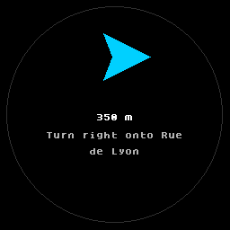
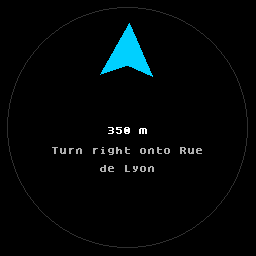
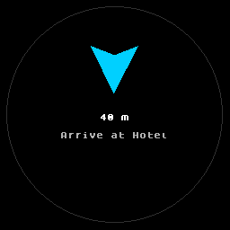

# Halo Engine

**Host-device runtime SDK for Brilliant Labs Halo smart glasses — graphics, streaming capabilities, and BLE transport.**

Halo is an open-source pair of smart glasses with an integrated near-eye color display, camera, microphones, bone-conduction speakers, motion sensors, a low-power processor, and Bluetooth LE connectivity. Its 0.2-inch OLEDoS display is mounted in the frame and optically presented in the wearer’s peripheral view.

> **Status:** research prototype. M1 agent-senses blockers (request IDs, microphone gain/photo quality wire encoding, streaming byte bounds, audio write pacing, and regression coverage) are closed on feature branches and pass unit/lint/Node tests. Physical-Halo validation, callback/throughput measurements, and Android device testing remain outstanding.

## Problem

Building a non-trivial Halo interface requires coordinating several layers:

- An agent needs a structured way to describe a visual scene.
- Halo runs a constrained Lua 5.4 environment rather than a conventional UI toolkit.
- The integrated color display exposes a 256×256 drawable area with immediate drawing and limited primitives.
- Large images cannot safely be embedded as escaped Lua source.
- BLE has negotiated MTU limits, message framing, and receiver-paced acknowledgements.
- A phone host must package resources and update the display without exceeding device limits.

Generating a large Lua script for every frame couples visual intent to transport details and can produce code that works in a desktop emulator but fails on the physical device.

## Approach

The engine separates **what to draw** from **how Halo receives it**:

```text
Agent or application
        │
        ▼
Halo Scene Description (HSD), a JSON scene graph
        │
        ├── small scene ──► bounded Lua REPL command
        │
        └── assets/frames ─► Halo Render Protocol (HRP)
                              │
                              ▼
                 official BLE message framing
                              │
                              ▼
                    Halo Lua runtime and APIs
```

HSD uses familiar scene-graph concepts: text, shapes, groups, rows, columns, and sprites. The compiler handles coordinate conversion, colors, font constraints, indexed sprite packing, resource IDs, and size validation.

HRP is a compact binary protocol carried inside the official Brilliant data-message framing. It reduces Lua source and parsing overhead while using existing `frame.display.*` APIs. It does not claim to add alpha blending, rotation, layers, double buffering, or other capabilities absent from stock firmware.

### Non-visual streaming

The same message layer also powers agent-facing device capabilities: microphone capture, photo capture, speaker playback, battery status, and tap/button input. The engine exposes:

- `HaloMessage` and `HaloSession` for request/response and chunk-based streaming with cancellation and bounded collection.
- `HaloLimitException` to abort streaming when a per-operation byte ceiling is exceeded.
- `BluetoothGattChannel` for the Android BLE transport, including bounded in-flight audio write pacing so `WRITE_TYPE_NO_RESPONSE` speaker frames stream without blocking on every callback.
- `HaloLz4` for LZ4 frame compression. `HaloRuntimeInstaller` uploads `he_runtime.lua` as compressed hex decoded by the stock `frame.compression` API (falling back to escaped-string upload), and sprite assets are LZ4-framed when the runtime advertises the `lz4` capability.
- `lua/he_runtime.lua` as the device-side dispatcher for display, microphone, speaker, camera, battery, input events, sound presets, power control, clock sync, IMU reads, HUD overlays, and tap tuning.
- `HUD_SET` (0x55) HUD overlay channel — the host sends target bearing, distance, and instruction once; `hud_tick()` then redraws a tilt-compensated compass arrow per frame from `frame.imu.raw()` on the glasses themselves, so heading changes cost zero BLE traffic. Used for live navigation cues (see the captures below).
- `main.lua` autorun — the installer can write a `main.lua` shim so the runtime boots on power-on/reset/wake without host involvement. The runtime answers a host `STATUS` query and advertises `;rt=<version>`, `;wake=<source>`, `fw=`, and `eui=`, letting hosts skip re-upload when a current runtime is already running.
- Device sprite file cache — `SPRITE_STORE` (0x61) persists a packed asset as `spr_<key>` (acknowledged by `SPRITE_STORED`, 0x73), and HRP opcode 0x10 defines a sprite from a cached key. `HsdHrpCompiler(cacheSprites = true)` derives content-hash keys and reports the assets a caller must ensure-store; `compile_scene_hrp_detailed(cache_sprites=True)` mirrors this in Python. An explicit `cache_key` HSD attribute asserts a pre-stored asset.

These abstractions live in `kotlin/` and `android/` and are consumed by the `dsh-android` agent-senses layer.

### Why HSD instead of Google's A2UI?

[A2UI](https://a2ui.org/) describes high-level interactive widgets (buttons, text fields, date pickers) that a client-side renderer maps to a native toolkit — a great fit for phones and browsers, but Halo has no widget toolkit to render into. Its display is a 256×256 circular area driven by Lua drawing primitives over a BLE byte budget, with tap-only input. HSD speaks that reality directly: pixel-precise primitives that compile to bounded Lua or binary HRP, with nothing lost in translation. An A2UI layer would still need a component→pixel compiler — which is exactly what this engine already is.

## Why Python, Kotlin, and Lua?

- **Python** is the reference implementation for rapid protocol work, image quantization, agent/MCP integration, and emulator validation.
- **Kotlin** is the intended production host for an Android phone and mirrors the compiler and HRP byte layout. Use the checked-in Gradle wrapper for reproducible builds.
- **Lua** runs on the glasses and is kept small because it executes inside Halo’s embedded runtime.

Python and Kotlin are expected to produce equivalent HSD/HRP behavior. Python provides reference vectors and hardware-free tests; Kotlin provides the Android integration path.

## Hardware-first principles

1. Stock Halo behavior is the compatibility boundary.
2. Conservative limits are applied before transmission; the emulator does not justify larger hardware payloads.
3. Binary assets use the data channel instead of escaped Lua literals.
4. Immediate drawing is handled explicitly because Halo has no hardware layers or double-buffered `show()` model.
5. Protocol limits and engine safety budgets are kept distinct from measurements that must be obtained on physical hardware.

## Quick start

Install the Python reference package:

```bash
python -m pip install -e ./python
```

Compile a small scene to Lua and preview it:

```bash
python -m halo_engine.compile scenes/running_hud.json --out /tmp/running_hud.lua
python -m halo_engine.preview /tmp/running_hud.lua --out /tmp/running_hud.png
```

Compile a hardware-bounded binary HRP frame:

```bash
python -m halo_engine.hrp_compile scenes/venus_image.json --out /tmp/venus.hrp
```

Run tests:

```bash
python -m pytest python/tests -q
./gradlew :kotlin:test
./gradlew :kotlin:build
```

The Android library target requires an Android SDK. Once configured, run:

```bash
./gradlew :android:assembleDebug
./gradlew :android:connectedDebugAndroidTest
```

## Examples

Source-controlled scene descriptions are in [`scenes/`](scenes/):

| Scene | Demonstrates | Recommended mode |
|---|---|---|
| [`running_hud.json`](scenes/running_hud.json) | Metrics and compact text layout | Lua or HRP |
| [`navigation_hud.json`](scenes/navigation_hud.json) | Directional primitive graphics | Lua or HRP |
| [`results_table.json`](scenes/results_table.json) | Excel-like grid and results | Lua or HRP |
| [`bar_chart.json`](scenes/bar_chart.json) | Axes, labels, and bars | Lua or HRP |
| [`btc_chart.json`](scenes/btc_chart.json) | Candlesticks and price overlay | Lua or HRP |
| [`icon_test.json`](scenes/icon_test.json) | Indexed sprite rendering | Lua or HRP via `hrp_compile` |
| [`venus_image.json`](scenes/venus_image.json) | 16-color indexed image | HRP |

### Rendered previews

These previews were generated by the same hardware-bounded HRP runtime used in the validation process. They show the 256×256 Halo drawable area and are included to make the scene language immediately understandable.

| Running HUD | Navigation HUD |
|---|---|
|  |  |

| Results table | Bar chart |
|---|---|
|  |  |

| BTC day chart | Icon test |
|---|---|
|  |  |

| Venus image |
|---|
|  |

The Venus source image is a Wikimedia Commons image used as a public-domain image-processing example: [source metadata](https://commons.wikimedia.org/wiki/File:Venus_botticelli_detail.jpg).

### Navigation HUD captures

The live `hud` capability renders a compass-driven turn arrow on-device. These frames were captured from the emulator by `python/capture_nav_hud.py` after injecting `HUD_SET` messages over the emulated BLE channel — no host traffic occurs between the first and second frames; `hud_tick()` tracks the glasses' own IMU heading.

| Turn cue | Facing target | Arrival |
|---|---|---|
|  |  |  |

## Repository structure

```text
scenes/                 HSD examples and image assets
python/halo_engine/     Python compiler, HRP, sprites, MCP, atlas, and diffs
python/tests/            Python and emulator tests
kotlin/                 Kotlin/JVM compiler, `HaloSession`, and host abstractions
android/                Android library, BluetoothGatt transport, and audio pacing
lua/                    Device-side HRP runtime and non-visual capability dispatcher
```

## Scope and boundary

### Owns

The Halo Engine owns the firmware-facing surface for Brilliant Labs Halo:

- **Halo Scene Description (HSD)** — JSON scene graph, validation, coordinate conversion, colors, fonts, sprite packing.
- **Halo Render Protocol (HRP)** — compact binary display protocol carried inside official BLE data-message framing.
- **Lua runtime** — `lua/he_runtime.lua` device-side dispatcher for display, sprite file cache, microphone, speaker, camera, battery, input events, and the `hud` overlay (compass-driven nav arrow), plus the `main.lua` autorun install path.
- **BLE transport** — `BluetoothGattChannel`, `AndroidBleTransport`, message framing, MTU negotiation, receiver-paced audio writes.
- **Streaming primitives** — `HaloMessage`, `HaloSession` for request/response and chunk-based streaming with cancellation and bounded collection.
- **Python and Kotlin vectors** — equivalent HSD/HRP compilation, emulator validation, and MCP integration.

### Does not own

The engine is deliberately unaware of higher-level agent and application concerns:

- **Generic sense contracts** — `SenseEndpoint`, `SenseCapability`, and `SenseProfile` live in `agent-senses/core`.
- **Agent tools and prompts** — `sense_*` tool definitions, dsh plugin adapters, and system prompts live in `dsh-android`.
- **On-device models** — Gemma inference, vision prepass, and TTS model loading live in `dsh-android`.
- **Product templates** — status, key/value, chart, and navigation HSD templates live in `dsh-android`.
- **Transcripts and chat semantics** — conversation history, tool-call parsing, and JSON-RPC transport live in `dsh-android`.

### Limitations

The current implementation targets Halo’s existing primitives: text, pixels, lines, rectangles, circles, polygons, indexed bitmaps, palette handling, and immediate drawing. It does not provide alpha blending, rotation, GPU layers, arbitrary polygon filling, or double buffering on stock firmware.

The project uses conservative safety budgets because exact usable memory and throughput depend on firmware configuration and workload. Emulator success is not a substitute for physical-device measurements.

## References

- [Brilliant Labs Halo](https://brilliant.xyz/products/halo)
- [Halo Hardware Manual](https://docs.brilliant.xyz/halo/hardware/)
- [Brilliant SDK](https://github.com/brilliantLabsAR/brilliant_sdk)
- [Halo Lua documentation](https://docs.brilliant.xyz/halo/halo-sdk-lua/)
- [Halo Bluetooth specifications](https://docs.brilliant.xyz/halo/halo-sdk-bluetooth-specs/)

## License

MIT. This is an independent research project and is not affiliated with Brilliant Labs or Garmin.
